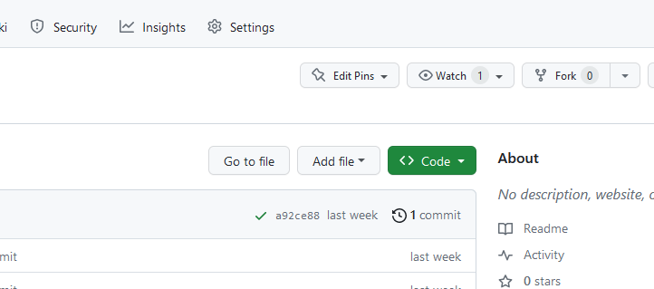
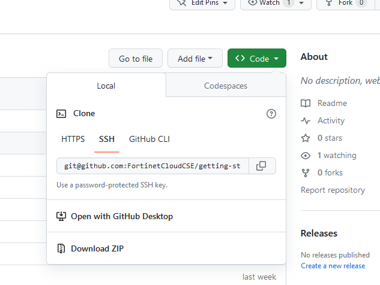

To clone an existing repo, open a web browser and navigate to the GitHub repo webpage, and click the green 'Code' dropdown button.



Then, copy the SSH link to your clipboard and open up a command line session. 



Paste the link onto the command line and add 'git clone' before it.

```shell
cd <directory where you'd like to place the local copy of the repo>
git clone <link copied to clipboard>
```
The repo will be copied into a new directory created in the present working directory.
