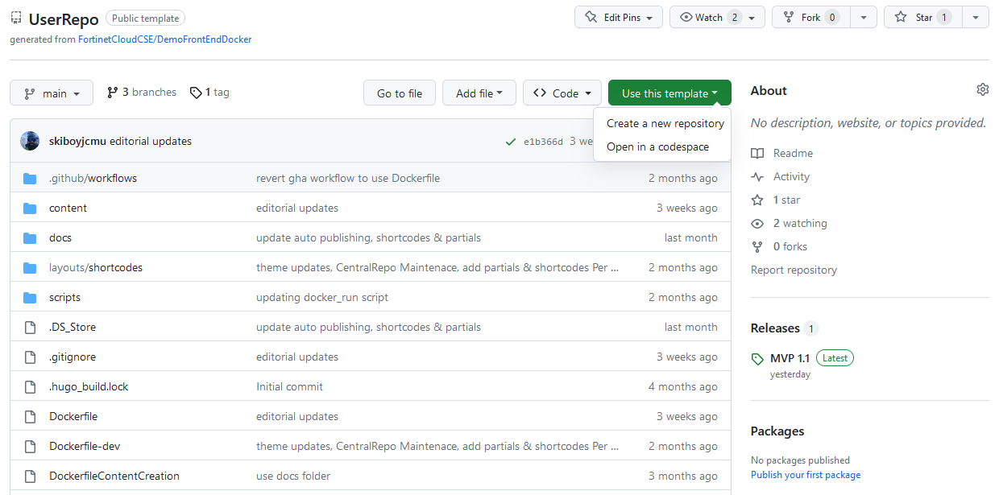
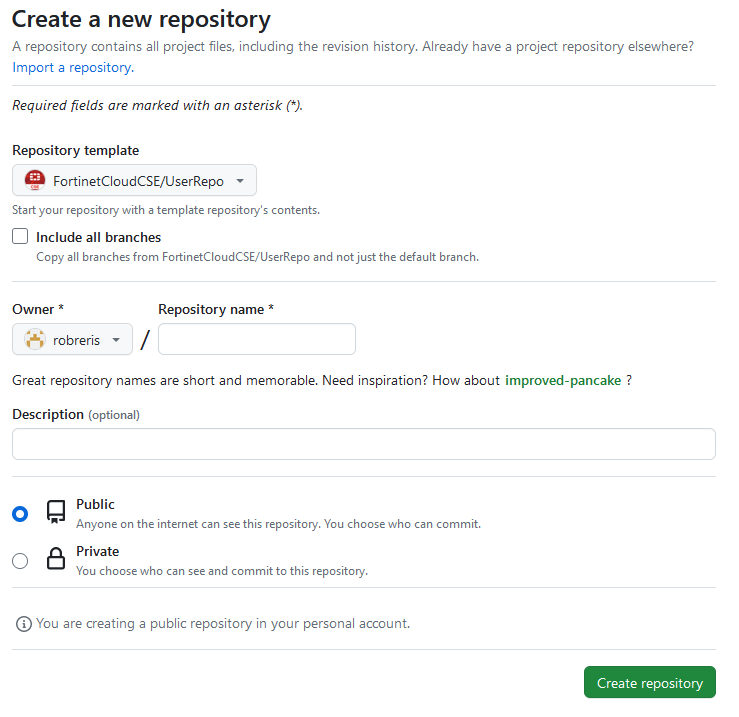

To begin developing a new Git/GitHub project, there are multiple options.

### Creating a new repo from a template

To create a repo from a template, as is done when developing [Workshops](https://fortinetcloudcse.github.io/UserRepo/index.html), navigate to the template repo, and click the green "Use this template" dropdown button, and click "Create a new repository". 

On the following screen, you can confirm the template you'd like to create the new repo from, select whether to include all branches in the repo, and select the owner/organization, and repo name. Once you've made your selections, click 'Create repository'.

You can now [clone](http://localhost:1313/getting-started/02git/clonerepo.html) the new repo locally.

### Creating a new FortinetCloudCSE repo via the GitHub console

