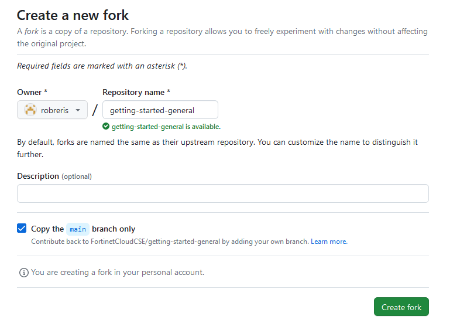

### Forking Intro

Forking enables the creation of a version of an already-existing repo in one's own GitHub account. This enables the development of customized changes to the repo without it affecting the original. 

To create a fork, navigate to the GitHub repo of choice, and click the 'Fork' button towards the top right of the screen.


Then, specify the owner/organization, and a name for the fork, and click 'Create fork'. You can also optionally fork the main branch only (default/checked) or fork all branches of the repo. 



Once the repo is forked, you may clone it locally as you would any other repo and commence with feature branch creation, etc.

### Syncing a fork with it's original counterpart

To sync the fork with it's original counterpart repo, after cloning the fork locally, you can add a new upstream pointing at the original, pull changes onto a new branch, and merge those into the fork. 

```shell
>git remote --v                                                                 ###display current remotes 
origin  git@github.com:FortinetCloudCSE/my-forked-repo.git (fetch)
origin  git@github.com:FortinetCloudCSE/my-forked-repo.git (push)

>git remote add upstream git@github.com:FortinetCloudCSE/original-repo.git      ###add new remote to track original repo

>git remote --v
origin  git@github.com:FortinetCloudCSE/my-forked-repo.git (fetch)
origin  git@github.com:FortinetCloudCSE/my-forked-repo.git (push)
upstream  git@github.com:FortinetCloudCSE/original-repo.git (fetch)
upstream  git@github.com:FortinetCloudCSE/original-repo.git (push)

>git checkout -b original-repo-branch                                           ###checkout new branch to pull in original repo updates

>git pull upstream main                     

>git push origin original-repo-branch                                           ###push updates to a new branch and create a PR

>git checkout main                                                            

>git pull                                                                       ###Ensure local and remote main branch are synced up

>git checkout origin original-repo-branch

>git rebase -i main                                                             ###rebase the new branch onto main

>git checkout main

>git merge --ff-only original-repo-branch                                       ###merge in updates once PR is approved

>git push --force
```
