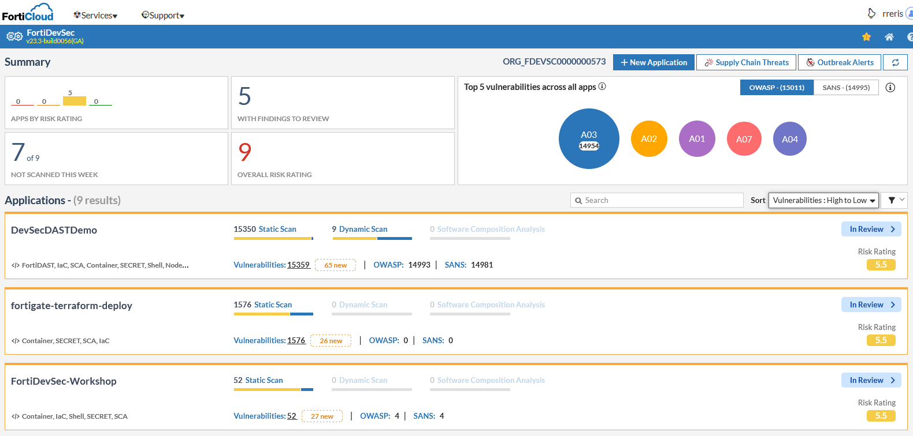

SAST testing with FortiDevSec is integrated with Jenkins to test our GitHub repo code.

For access to the FortiDevSec console, please email FortinetCloudCSE@fortinet.com.

Once you've received an IAM username, to log in, navigate to [https://fortidevsec.forticloud.com/devsec-home](https://fortidevsec.forticloud.com/devsec-home), and click 'Login' at the top right of the screen.

At the next screen, click 'IAM LOGIN', and enter the Account ID and username that you should have received from FortinetCloudCSE@fortinet.com.

This will take you to the FortiDevSec console, where you can view all applications within the organization.

Click on an application to view scans performed.

This screen displays all of the various scans performed on the application including the number of vulnerabilities in each scan and it's risk score. Click 'View All' to see a list of all vulnerabilities.

On this screen, you can filter by risk rating, status, category, etc.

Click on a scan to list vulnerabilities only associated with that scan.

Click on a vulnerability to view more information on that specific vulnerability.

The modal that appears will display information useful for remediation including file location, Git commit ID, branch, and first and last appearance date/time. 

Scrolling down within the modal will display CWE, OWASP, and SANS information as well as other occurrences of the vulnerability within the repo. 

