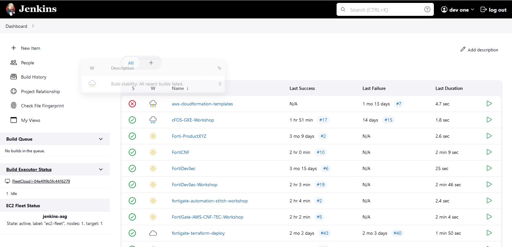
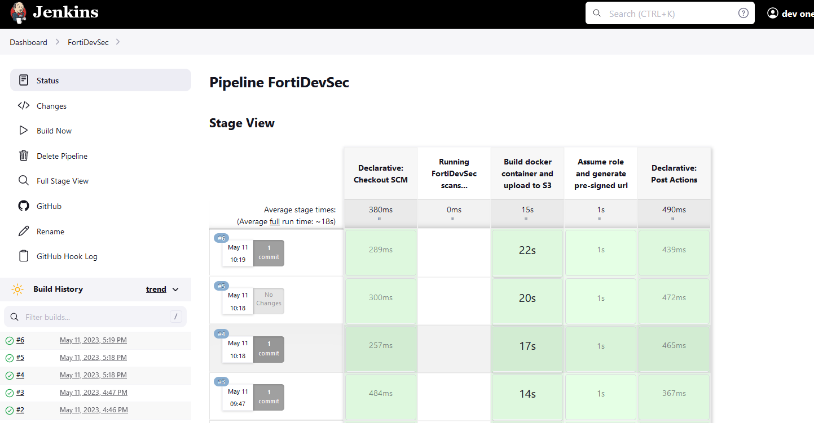
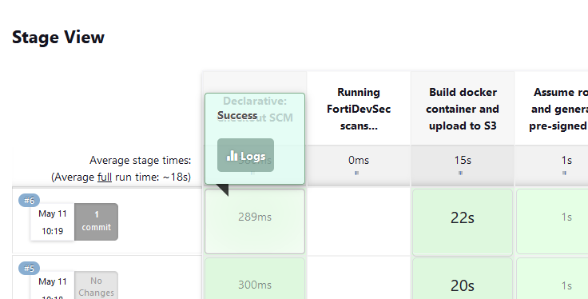
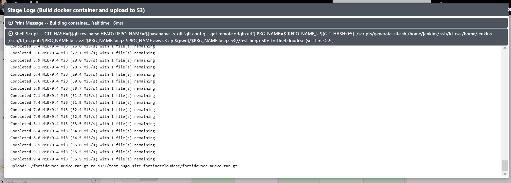
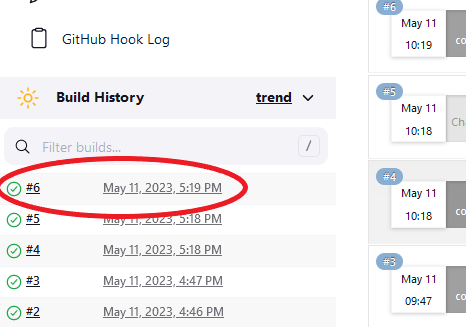
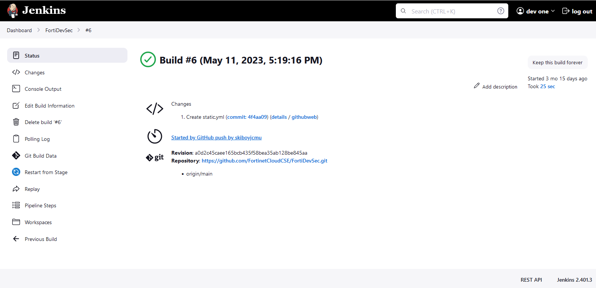
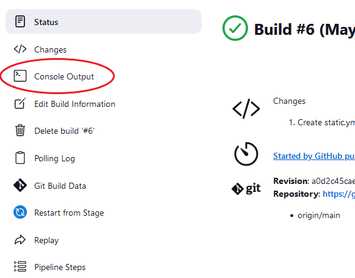
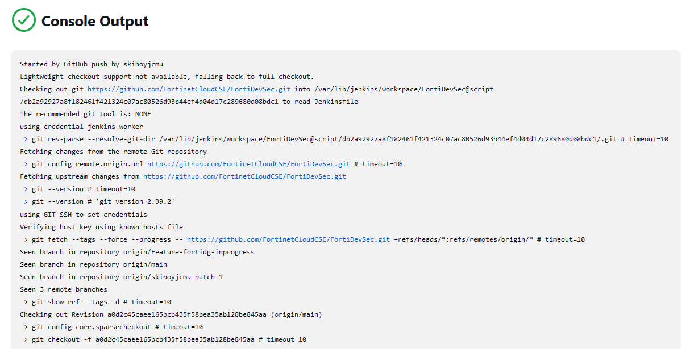

To log into our Jenkins console, navigate to [https://jenkins.fortinetcloudcse.com:8443](https://jenkins.fortinetcloudcse.com:8443).

If you haven't yet received a login, please email FortinetCloudCSE@fortinet.com.

When logged in, you may view a list of current pipelines:



Clicking on a pipeline will take you to **Stage View**, when you can view more details on the status of that particular pipeline, including build history success/failure and average duration of each stage in a build.



To view logs associated with each stage, hover over the stage and click 'Logs'. This can be helpful in troubleshooting failing builds/stages.




You can also click on a particular build under **Build History** to view more details on the build. 




Clicking **Console Output** will show detailed logging information as well.




### Jenkinsfile

In each repo, there will be a Jenkinsfile containing build instructions to be carried out by Jenkins when your code is pushed to it's GitHub remote.

```shell
void setBuildStatus(String message, String state, String repo_url) {
  step([
      $class: "GitHubCommitStatusSetter",
      reposSource: [$class: "ManuallyEnteredRepositorySource", url: repo_url],
      contextSource: [$class: "ManuallyEnteredCommitContextSource", context: "ci/jenkins/build-status"],
      errorHandlers: [[$class: "ChangingBuildStatusErrorHandler", result: "UNSTABLE"]],
      statusResultSource: [ $class: "ConditionalStatusResultSource", results: [[$class: "AnyBuildResult", message: message, state: state]] ]
  ]);
}

pipeline {
    agent any

    stages {

       stage('Running FortiDevSec scans....') {
            when { expression { false } }
            steps {
                echo "Running SAST scan..."
                sh 'env | grep -E "JENKINS_HOME|BUILD_ID|GIT_BRANCH|GIT_COMMIT" > /tmp/env'
                sh 'docker pull registry.fortidevsec.forticloud.com/fdevsec_sast:latest'
                sh 'docker run --rm --env-file /tmp/env --mount type=bind,source=$PWD,target=/scan registry.fortidevsec.forticloud.com/fdevsec_sast:latest'
            }
        }
    }
    post {
     success {
        setBuildStatus("Build succeeded", "SUCCESS", "${GIT_URL}");
     }
     failure {
        setBuildStatus("Build failed", "FAILURE", "${GIT_URL}");
     }
  }
}
```

Most of the file can be ignored and should not be altered in day-to-day development. For testing and at the time of repository creation, however, certain tests may be disabled and if so, should be enabled when you're ready to push and merge:

In each stage, ensure the 'when' expression is set to true:

```shell
   when { expression { true } }
```

